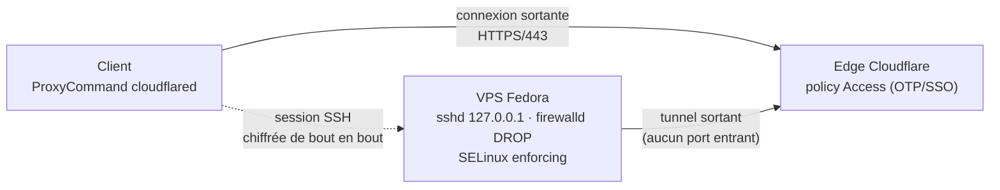

# VPS de développement (Fedora, zéro port entrant)

[](https://github.com/Raf7c/vps/actions/workflows/ci.yml)
[](LICENSE)

Infrastructure as Code d'un VPS de développement Fedora sans **aucun port exposé sur
Internet** : l'accès passe exclusivement par un tunnel sortant (Cloudflare Tunnel),
doublement authentifié (Cloudflare Access + clé SSH). L'environnement reproduit un
poste de travail restreint : l'utilisateur de développement n'a **aucun privilège**.



## Principes

- **Zéro entrant** : le VPS n'établit que des connexions sortantes ; `sshd` n'écoute
  que sur localhost ; firewalld public en target DROP. Un scan externe ne voit rien.
- **Séparation des privilèges** : `dev`¹ : utilisateur de travail, sans sudo, sans
  mot de passe ; `admin` : compte wheel réservé à Ansible et à la console de secours ;
  root verrouillé.
- **Le système appartient à Ansible** : toute modification système passe par un rôle
  et `just provision` (paquets : dépôts officiels Fedora uniquement, une exception
  documentée). L'utilisateur de travail n'installe rien au niveau système : il dispose
  de toolbox/podman rootless et de `~/bin` pour ses besoins propres.
- **Secrets matériels** : SOPS chiffre les valeurs vers des clés **age portées par
  YubiKey** (PIN + toucher physique à chaque déchiffrement). Aucun secret racine sur
  disque ; deux destinataires (YubiKey quotidienne + YubiKey de secours rangée
  ailleurs), matériels exclusivement. Les mêmes clés portent les accès SSH
  (`ed25519-sk` résidentes) : un seul objet physique commande tout.

¹ *Les exemples de cette documentation utilisent `dev`, `example.com` et
`203.0.113.10` : adapter à vos valeurs (`private.sops.yml`, cf. docs/SETUP.md).*

## Démarrage

Prérequis : un domaine géré chez Cloudflare, un VPS Fedora, et sur la machine de
contrôle : `ansible`, `just`, `cloudflared`, `sops`, `age-plugin-yubikey`.

La mise en service complète (Cloudflare, secrets, bootstrap, vérifications) est un
runbook unique à dérouler dans l'ordre : **[docs/SETUP.md](docs/SETUP.md)**.
En résumé : configurer le tunnel côté Cloudflare, remplir et chiffrer
`private.sops.yml`/`vault.sops.yml`, puis `just bootstrap <ip> [user]` (une fois)
et `just provision` (toujours).

## Commandes

| Commande | Effet |
|---|---|
| `just unlock` | déverrouille la YubiKey (PIN) pour la session ; à lancer une fois |
| `just check [clé]` | dry-run (`--check --diff`), systématique avant tout apply |
| `just provision [clé]` | applique l'état complet via le tunnel |
| `just lint` | ansible-lint (profil production) + yamllint |
| `just vault-edit` / `just private-edit` | éditer secrets / valeurs identifiantes (chiffrés) |
| `just bootstrap <ip> [user] [clé]` | premier provisionnement uniquement |
| `just ping` / `just facts` | connectivité / facts de l'hôte |

## Structure

```
inventories/prod/   inventaire + group_vars (vars.yml clair ; private.sops.yml et vault.sops.yml chiffrés SOPS)
playbooks/          bootstrap.yml (initial) · site.yml (courant)
roles/              base · accounts · cloudflared · hardening · devtools · backup
docs/               ARCHITECTURE · SETUP · OPERATIONS · CLIENT-POSTE
```

## Documentation

- [ARCHITECTURE.md](docs/ARCHITECTURE.md) : décisions de conception et modèle de menace
- [SETUP.md](docs/SETUP.md) : mise en service pas à pas
- [OPERATIONS.md](docs/OPERATIONS.md) : exploitation (paquets, clés, backups, dépannage, reconstruction)
- [CLIENT-POSTE.md](docs/CLIENT-POSTE.md) : accès depuis un poste sans droits admin
