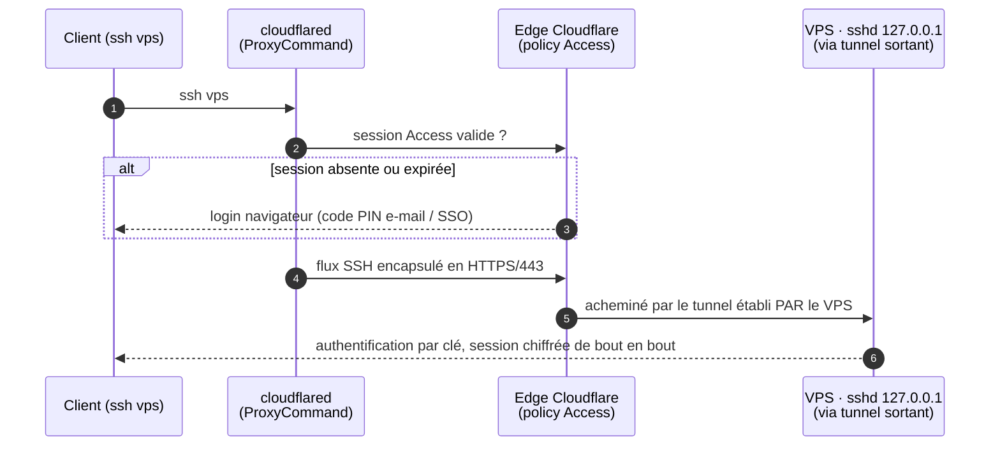

[README](../README.md) · **Architecture** · [Setup](SETUP.md) · [Opérations](OPERATIONS.md) · [Client](CLIENT-POSTE.md)

# Architecture

Décisions de conception et modèle de menace. Les exemples utilisent `dev`,
`admin`, `example.com` et `203.0.113.10` ; les valeurs réelles vivent dans
`private.yml` et `vault.yml` (chiffrés).

## 1. Exigences et modèle de menace

| Exigence | Conséquence de conception |
|---|---|
| Données sensibles sur le VPS | Aucun service exposé, chiffrement de bout en bout, secrets chiffrés au repos, backups chiffrés côté client |
| Zéro connexion entrante | Accès par tunnel **sortant** uniquement ; firewalld public en DROP ; `sshd` sur 127.0.0.1/::1 |
| Client sans droits admin (poste restreint) | Le client d'accès doit fonctionner en espace utilisateur : binaire dans `~/bin`, aucun daemon, aucun sudo |
| Refléter un poste de travail restreint | L'utilisateur de développement n'a aucune capacité d'élévation |
| Approvisionnement système contrôlé | Le système n'est modifié que par Ansible ; paquets issus des dépôts officiels Fedora (une exception, §2.1) |
| Reproductibilité | Idempotence stricte, tout versionné, reconstruction en deux commandes |

**Menaces couvertes** : scans et bruteforce Internet (surface nulle) ; compromission de
l'intermédiaire de tunnel (le flux SSH reste chiffré de bout en bout, l'empreinte du
serveur est vérifiée côté client) ; vol de disque ou snapshot chez le provider (secrets
chiffrés, backups chiffrés côté client) ; compromission de la session de travail
(l'utilisateur n'a aucun privilège : le système est intouchable).

**Menaces résiduelles** : compromission du compte Cloudflare (mitigée par MFA
obligatoire) ; compromission d'une machine cliente (clés SSH par machine, révocables
individuellement) ; l'hyperviseur du provider (irréductible sur un VPS loué).

## 2. Accès : Cloudflare Tunnel

`cloudflared` maintient depuis le VPS une connexion sortante vers l'edge Cloudflare.
Côté client, `cloudflared access ssh` en `ProxyCommand` encapsule le flux SSH dans du
HTTPS/443 et traverse les réseaux restrictifs comme du trafic web ordinaire, sans
daemon ni privilège. Deux couches d'authentification indépendantes : une policy
**Cloudflare Access** (OTP e-mail/SSO) contrôle qui atteint le tunnel, puis
l'authentification par **clé SSH** contrôle qui ouvre une session.



Alternative évaluée : Tailscale (mesh WireGuard, mode userspace sans root). Écartée
car inutilisable depuis les postes restreints cibles ; Cloudflare Tunnel couvre tous
les clients avec un seul mécanisme, au prix d'un domaine géré chez Cloudflare et du
transit par leur edge (métadonnées de connexion visibles ; contenu SSH chiffré de
bout en bout ; le mode *browser rendering*, qui casserait cette propriété, est
désactivé et réservé au dépannage conscient).

### 2.1 Exception à la règle « dépôts officiels »

`cloudflared` n'est pas packagé par Fedora. Il provient du dépôt RPM signé de
Cloudflare (`pkg.cloudflare.com`, clé GPG épinglée dans le rôle). C'est l'unique
écart, compensé par : signature GPG vérifiée, mises à jour couvertes par
`dnf-automatic`, service systemd sandboxé (`DynamicUser`, `ProtectSystem=strict`,
`--no-autoupdate`). L'alternative 100 % dépôts officiels (WireGuard brut) exigerait
un port UDP entrant, contraire à l'exigence primaire.

## 3. Architecture cible

```
                     Internet
                        │  sortant uniquement : cloudflared, dnf, restic
        ┌───────────────▼────────────────────────────┐
        │  VPS Fedora                                │
        │  firewalld : zone public = DROP            │
        │  sshd : 127.0.0.1 / ::1 uniquement         │
        │  cloudflared (sandboxé) → localhost:22     │
        │  SELinux enforcing · dnf-automatic · auditd│
        │  user "dev" (aucun sudo) · "admin" (wheel) │
        └────────────────────────────────────────────┘
                        ▲ tunnel sortant HTTPS/443
                 edge Cloudflare + policy Access
        ┌───────────────┴───────────────┐
   poste restreint                 machines personnelles
   (~/bin/cloudflared)             (cloudflared + Ansible)
```

Défense en profondeur, quatre couches sans mécanisme commun : firewall en DROP,
bind localhost de sshd, policy Access à l'edge, clé SSH par machine.

## 4. Comptes et privilèges

| Compte | Rôle | Connexion | Élévation | Mot de passe |
|---|---|---|---|---|
| `dev` | travail quotidien | clé SSH via tunnel | aucune | aucun (verrouillé) |
| `admin` | Ansible + secours console | clé SSH via tunnel, console provider | sudo avec mot de passe | vault, hashé sha512, posé à la création |
| root | aucun | jamais en direct | aucune | verrouillé |

Le compte cloud créé par le provider ne sert qu'à créer `admin` au premier play
du bootstrap ; il est supprimé avant la fin du même run (`cloud_users_to_remove`). Une clé SSH **par machine cliente**, jamais partagée :
la révocation se fait par retrait de la clé dans `private.yml` + `just provision`.

## 5. Hardening (rôle `hardening`)

- **firewalld** : zone `public` sans service ni port, target DROP (silencieux).
- **sshd** (drop-in validé par `sshd -t` avant application) : `ListenAddress`
  127.0.0.1 et ::1, clés uniquement, `PermitRootLogin no`, `AllowUsers dev admin`,
  `MaxAuthTries 3`, pas de forwarding X11/agent.
- **SELinux** : enforcing (jamais désactivé).
- **Mises à jour** : `dnf-automatic`, correctifs de sécurité appliqués
  automatiquement, reboot si le kernel l'exige.
- **auditd** : traçabilité des exec root, des modifications de sudoers, de la
  configuration SSH et des fichiers d'identité.
- **sysctl** : rejet des redirects ICMP et du source routing, `ptrace_scope=1`,
  `kptr_restrict`, `dmesg_restrict`.
- **Divers** : umask 027, journald persistant, handlers appliqués immédiatement
  en fin de rôle (un échec ultérieur ne peut pas laisser sshd dans un état
  intermédiaire).

## 6. Environnement de développement (rôle `devtools`)

Liste volontairement minimale, installée par Ansible
depuis les dépôts officiels : `git`, `gcc`, `make`, `gdb`, `valgrind` (le socle),
`tmux` et `neovim` (travail à distance), `podman` et `toolbox` (installation sans
root). `zsh` est dans les paquets de base (shell de login). Le *linger* systemd est
activé pour l'utilisateur de travail (ses services user et conteneurs survivent à
la déconnexion). Tout besoin ponctuel passe par une toolbox ou par un ajout
explicite à la liste.

L'utilisateur de travail ne modifie jamais le système. Ses espaces d'installation
autonomes (toolbox, `~/bin`) sont documentés dans
[OPERATIONS.md](OPERATIONS.md#paquets).

Monitoring : volontairement absent. L'observabilité passe par `htop`, `journalctl`
(persistant) et `ausearch`. Une stack conteneurisée (node_exporter/Prometheus/Grafana
en quadlets rootless liés à localhost, publiée via un ingress dédié) reste
possible ; l'implémentation complète est dans l'historique git.

## 7. Approvisionnement et secrets

- **Bootstrap autosuffisant** : un seul run via l'IP publique, en deux plays ; le
  compte cloud du provider crée `admin` puis disparaît, `admin` monte le tunnel et
  verrouille sshd sur localhost. Tous les runs suivants passent par le tunnel
  (`ProxyCommand` dans l'inventaire).
- **Idempotence** : `ansible-lint` profil production ; `just check` avant tout apply.
- **Secrets** : ansible-vault (inclus dans ansible-core, chaîne d'outillage 100 %
  standard). Contenu : token du tunnel, mot de passe du compte admin, credentials de
  backup. `no_log` sur toute tâche qui les manipule. Le fichier de mot de passe du
  vault est local et gitignoré ; le sudo d'Ansible (`ansible_become_password`) est
  alimenté depuis le vault, sans aucune saisie interactive.

## 8. Sauvegardes (rôle `backup`, optionnel)

`restic` vers un stockage objet (S3/B2) : chiffrement **côté client**, connexion
sortante uniquement, timer systemd quotidien, rétention 7j/4sem/6mois, service
sandboxé (`ProtectSystem=strict`, `NoNewPrivileges`). Désactivé tant que
`vault_restic_repository` est vide. Procédures d'activation et de test de
restauration : [OPERATIONS.md](OPERATIONS.md#backups).
